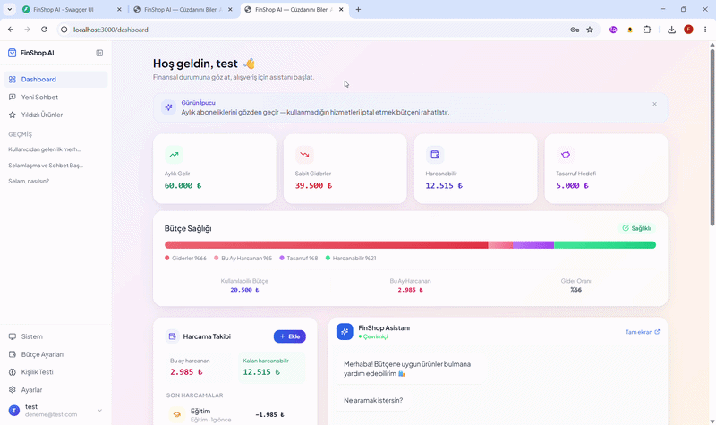
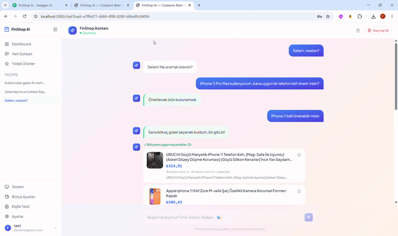

# 🛒 FinShop AI

## "Cüzdanını Bilen Akıllı Alışveriş Asistanı"

FinShop AI, finans (FinTech) ve e-ticaret temalarını yenilikçi bir şekilde birleştiren, **çoklu-ajanlı (multi-agent) yapay zeka mimarisine** dayalı akıllı bir alışveriş ve bütçe yönetim platformudur. 

Platform, kullanıcıların harcama alışkanlıklarını, kişilik özelliklerini ve anlık bütçe durumlarını analiz ederek kişiselleştirilmiş bir alışveriş deneyimi sunar. Klasik e-ticaret platformlarının aksine FinShop AI, "daha fazla harcatmayı" değil, "daha akıllı ve bütçe dostu harcatmayı" hedefler.

---

## 🚀 Proje Amacı ve Vizyonu

Günümüzde kullanıcılar, e-ticaret sitelerinin teşvik edici yapısı nedeniyle genellikle bütçelerini aşmakta ve ihtiyaç dışı harcamalar yapmaktadır. FinShop AI bu problemi çözmek için:
- Kullanıcının bütçesini ve harcama alışkanlıklarını analiz eder.
- Özel bir "Kişilik Testi" ile kullanıcının harcama profilini (savruk, dengeli, tutumlu vb.) çıkarır.
- Gelişmiş AI ajanları sayesinde kullanıcıyla doğal bir sohbet yürütür ve ona özel, fiyat-performans odaklı ürün önerileri sunar.

---

## 🧠 Gelişmiş Agentic AI Mimarisi

Sistemin kalbinde, **LangChain** ve **LangGraph** ile orkestre edilen, Google Gemini destekli kompleks bir Çoklu-Ajan (Multi-Agent) sistemi yatmaktadır. Her bir ajan, belirli bir uzmanlık alanında görev yapar ve kusursuz bir uyum içinde çalışır:

- 🧱 **Base Agent:** Tüm ajanların miras aldığı soyut temel sınıf. LLM çağrıları, loglama, zamanlama ve hata yönetimi altyapısını sağlar.
- 👮 **Security Agent:** Kullanıcı girdilerini denetler, prompt injection ve zararlı içeriklere karşı sistemi korur.
- 🗣️ **Conversation Agent:** Kullanıcı ile doğal, empati kurabilen ve bağlama uygun bir diyalog yürütür.
- 🕵️ **Search Agent:** SerpApi vb. araçları kullanarak internet üzerinde anlık ve en doğru ürün araştırmasını yapar.
- 🧠 **Personality Agent:** Kullanıcının kişilik tipine göre harcama psikolojisini analiz eder.
- 💰 **Budget Agent:** Kullanıcının finansal durumunu takip eder ve ürün önerilerinin bütçe sınırları içinde kalmasını sağlar.
- 🎯 **Recommendation Agent:** Arama sonuçlarını, bütçe kısıtlarını ve kullanıcı profilini harmanlayarak en ideal ürünleri belirler.
- ⚖️ **Review Agent:** Önerilecek ürünlerin kalitesini, kullanıcı yorumlarını ve fiyat-performans oranını değerlendirir.
- ⭐ **Watchlist Agent:** Kullanıcının ilgilendiği veya favoriye aldığı ürünleri yönetir.
- 🎼 **Orchestrator:** Tüm bu ajanlar arasındaki veri akışını, karar mekanizmalarını ve görev sıralamasını yöneten ana kontrolcüdür.

---

## 🏗️ Kullanılan Teknolojiler

Proje, güncel, yüksek performanslı ve ölçeklenebilir teknolojiler kullanılarak inşa edilmiştir:

### 🎨 Frontend
- **Framework:** Next.js 14 (App Router)
- **Kütüphane:** React 18, TypeScript
- **Stil & UI:** Tailwind CSS 3, Framer Motion, lucide-react
- **Grafik & Veri Görselleştirme:** Recharts
- **Çoklu Dil (i18n):** i18next, react-i18next

### ⚙️ Backend
- **Framework:** FastAPI (Python)
- **Veritabanı:** Supabase (PostgreSQL)
- **AI & LLM:** Google Gemini API, LangChain, LangGraph , Manus API
- **Arama Motoru Entegrasyonu:** SerpApi (google-search-results)
- **Güvenlik & Auth:** JWT Authentication, passlib, python-jose, slowapi

---

## 📂 Proje Yapısı

```bash
FinShop-AI/
│
├── backend/                        # FastAPI tabanlı asenkron backend servisleri
│   ├── app/                        # Ana uygulama çekirdeği
│   │   ├── agents/                 # 🤖 AI Ajan Katmanı (base_agent + 9 uzman ajan)
│   │   ├── api/                    # REST API Endpoint'leri
│   │   │   └── routes/             # Rota tanımları (auth, chat, budget vb.)
│   │   ├── core/                   # Yapılandırma, güvenlik ve loglama
│   │   ├── models/                 # Pydantic veri modelleri
│   │   ├── prompts/                # AI sistem promptları
│   │   └── services/               # İş mantığı servisleri
│   │       └── llm/                # LLM Client'lar (Gemini, Manus)
│   ├── scripts/                    # Otomasyon betikleri ve seed scriptleri
│   ├── tests/                      # Birim ve entegrasyon testleri
│   ├── logs/                       # Uygulama logları
│   ├── requirements.txt            # Python bağımlılıkları
│   └── *_schema.sql                # Veritabanı şemaları (Supabase, Watchlist, Security Logs)
│
├── frontend/                       # Next.js 14 tabanlı modern web arayüzü
│   ├── app/                        # Next.js App Router
│   │   ├── login/                  # Giriş sayfası
│   │   ├── register/               # Kayıt sayfası
│   │   ├── onboarding/             # Kullanıcı karşılama akışı
│   │   │   ├── personality/        # Kişilik testi
│   │   │   └── budget/             # Bütçe bilgisi girişi
│   │   ├── dashboard/              # Ana kontrol paneli
│   │   │   └── components/         # Dashboard bileşenleri (10 komponent)
│   │   ├── chat/                   # AI Alışveriş Asistanı
│   │   │   └── history/            # Geçmiş sohbetler
│   │   ├── watchlist/              # Favori / takip edilen ürünler
│   │   ├── settings/               # Ayarlar
│   │   │   └── account/            # Hesap ayarları
│   │   └── support/                # Destek sayfası
│   ├── hooks/                      # Özel React Hook'ları
│   ├── lib/                        # API bağlantıları, i18n ve yardımcı araçlar
│   └── types/                      # TypeScript tip tanımlamaları
│
├── Images/                         # Proje görselleri ve sunum materyalleri
├── .gitignore                      # Git tarafından yok sayılacak dosyalar
└── readme.md                       # Proje tanıtım ve kurulum dökümanı
```

---

## ⚙️ Kurulum ve Çalıştırma

Projeyi yerel ortamınızda çalıştırmak için aşağıdaki adımları izleyebilirsiniz.

### 1️⃣ Projeyi Klonlayın

```bash
git clone <repo-link>
cd FinShop-AI
```

### 2️⃣ Backend Kurulumu

Backend'in çalışabilmesi için `.env` dosyanızı oluşturmalı ve API anahtarlarını (Gemini, Supabase vb.) girmelisiniz.

```bash
cd backend
python -m venv venv
source venv/bin/activate  # Windows için: venv\Scripts\activate
pip install -r requirements.txt

# Çevresel değişkenleri yapılandırın (backend/.env dosyasını oluşturun)
# GEMINI_API_KEY=...
# SUPABASE_URL=...
# SUPABASE_KEY=...
# JWT_SECRET_KEY=...
# MANUS_API_KEY=...
# SERPAPI_KEY=...

# Sunucuyu başlatın
uvicorn app.main:app --reload
```

### 3️⃣ Frontend Kurulumu

Yeni bir terminal açın ve frontend klasörüne gidin. Frontend için de `.env.local` dosyası oluşturmanız gerekmektedir.

```bash
cd frontend

# Çevresel değişkeni oluşturun
echo NEXT_PUBLIC_API_URL=http://localhost:8000 > .env.local

# Bağımlılıkları yükleyin
npm install

# Geliştirme sunucusunu başlatın
npm run dev
```
İki ayrı terminalde backend ve frontend'i çalıştırarak http://localhost:3000 adresinde projemizi test edebilirsiniz.

---

## 📸 Proje Görselleri ve Çalışma Zamanı (Runtime) Akışları

Projenin temel modüllerinin, kullanıcı arayüzü etkileşimlerinin ve yapay zeka ajan entegrasyonlarının canlı çalışma akışları aşağıda detaylandırılmıştır:

### 🌐 1. Platform Vizyonu ve "Nasıl Çalışır?" Akışı
Kullanıcıyı karşılayan modern, animasyonlu Landing Page arayüzü. Bu akışta platformun temel felsefesi, sunduğu çözümler, projenin işleyiş adımları ve kullanıcıyı finansal farkındalığa hazırlayan ilk etkileşim katmanı gösterilmektedir.


### 🔐 2. Güvenli Kimlik Doğrulama ve Kayıt Akışı
Supabase altyapısı kullanılarak tasarlanan, JWT (JSON Web Token) tabanlı güvenli kimlik doğrulama (Authentication) mimarisi. Kullanıcının sisteme ilk defa kayıt olma ve güvenli oturum açma süreçlerinin arayüz simülasyonu.


### 📊 3. Dinamik Dashboard ve Proaktif Bütçe Analizi
Sisteme giriş yapıldıktan sonra Next.js dashboard'un asenkron olarak yüklenme anı. Kullanıcının Supabase'den çekilen anlık bütçe kartları, harcama limitleri, "Tutumlu Harcayıcı" gibi yapay zeka tarafından analiz edilen finansal profili ve proaktif tasarruf önerilerinin listelenmesi.



### 🤖 4. Çoklu Ajan (Multi-Agent) Sistemi ve Akıllı Alışveriş Sohbeti
Kullanıcının bütçesine göre akıllı telefon ve kılıf arama senaryosu. Girdinin `SecurityAgent` filtresinden geçerek `ConversationAgent` vasıtasıyla anlamlandırılması, bütçe limitlerine göre saniyeler içinde fiyat-performans ve muadil ürün kartlarının dinamik olarak ekrana basılması süreci. Sonrasında "Yıldızlı Ürünler" (Takip Listesi) modülünün çalışma akışı.




## 👥 Ekip ve Görev Dağılımı

Bu proje 3 kişilik bir ekip tarafından, her üyenin hem frontend hem backend tarafında aktif görev aldığı bir yapıyla geliştirilmiştir:

- **Üye 1:**
  - **Frontend:** Navbar, Sidebar, QuickActions, Dashboard düzeni, genel UI/UX tasarımı
  - **Backend:** Search Agent, Conversation Agent, Orchestrator

- **Üye 2:**
  - **Frontend:** BudgetCards, ExpenseTracker, AddExpenseModal
  - **Backend:** Budget Agent, Personality Agent, Recommendation Agent, Supabase şema tasarımı

- **Üye 3:**
  - **Frontend:** SavingsTips, ChatPreview, WishlistWidget, DailyTip, Watchlist sayfası
  - **Backend:** Watchlist Agent, Review Agent, Security Agent, Manus API entegrasyonu

---

## 🎯 Yarışma Teması ve Hedefler

**FinShop AI**, Finans ve E-Ticaret temalı yarışma kapsamında, aşağıdaki hedeflere ulaşmak amacıyla tasarlanmıştır:
1. Kullanıcılarda finansal farkındalık ve bütçe disiplini oluşturmak.
2. İnternet üzerindeki bilgi kirliliğini ajanlar aracılığıyla filtreleyerek nokta atışı alışveriş deneyimi sunmak.
3. E-ticareti, yapay zeka destekli bir finans danışmanlığı süreci ile birleştirmek.

---

## 💌 Test İçin Kullanıcı Giriş Bilgileri

- **E-Posta:** deneme@test.com
- **Şifre:** test1234
  
---

## 📄 Lisans

Bu proje, eğitim ve yarışma amacıyla açık kaynak olarak geliştirilmiştir.

---

<div align="center">
  <b>FinShop AI</b><br>
  <i>"Cüzdanını Bilen Akıllı Alışveriş Asistanı"</i>
</div>
